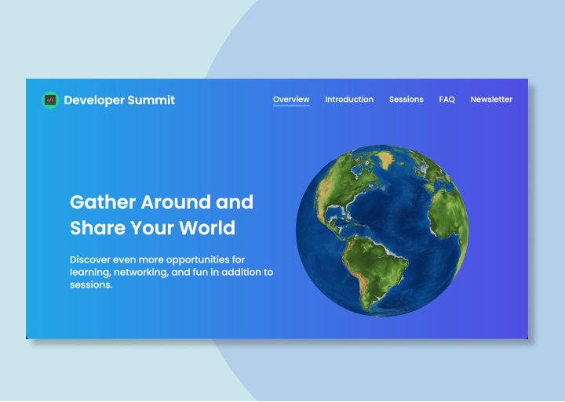
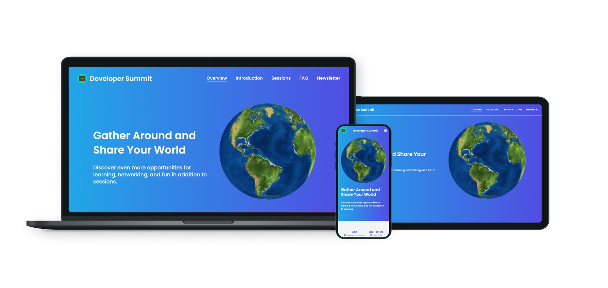

<h3 align="center">Landing Page</h3>

Developer Summit - Built using Vue JS and Tailwind

  

## About
The landing page for the "Developer Summit" is the moc website that is sanitized introductory information. 
 
This website was built to make it easier for participants to recognize and find information about the event.

## Responsive Test

  

## Languages and Tools
- Vue JS 3
- Tailwindcss
- Font Awesome 5
- Google Fonts Poppins
- Vite JS
- Git 

### How to install
- <code>git clone https://github.com/jGEVyY/landing_vue_3.git </code>
- <code>cd landing-page-main</code>
- <code>npm install</code>
- <code>npm run dev</code>
